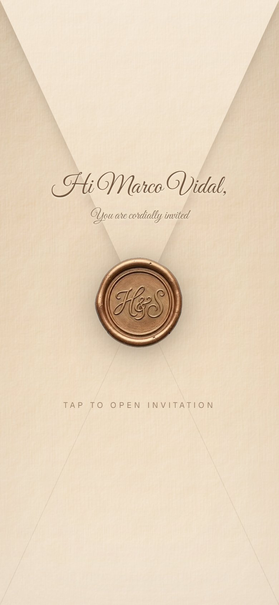
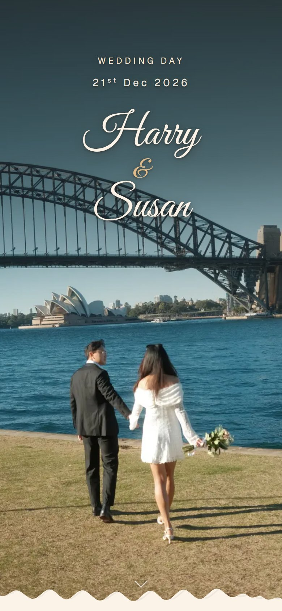
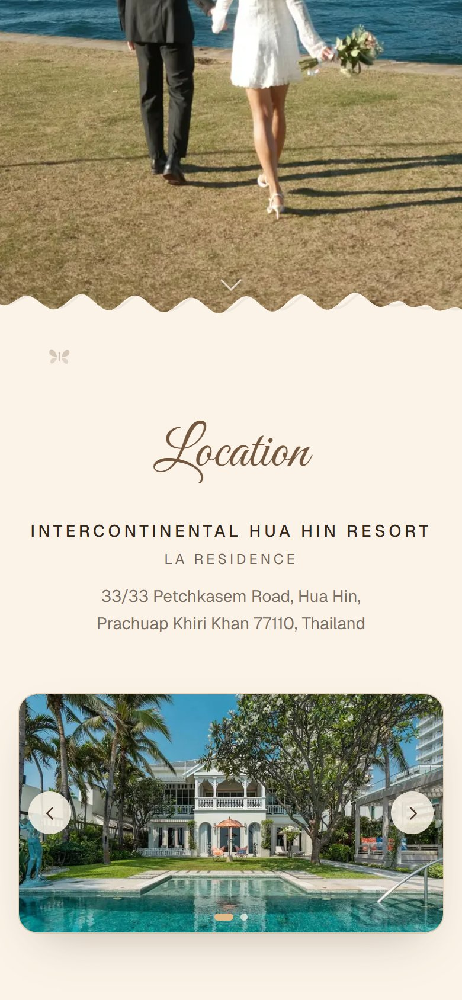
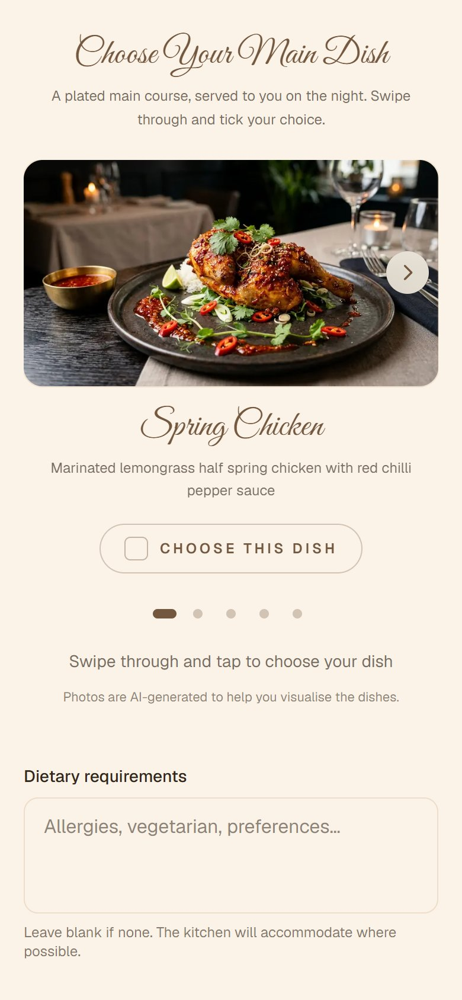
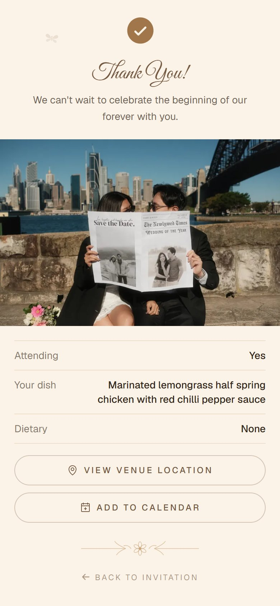
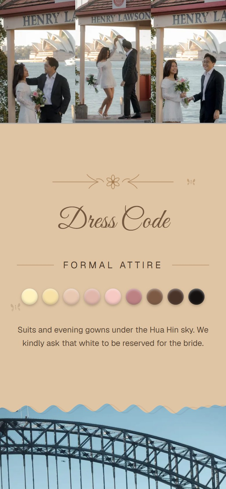
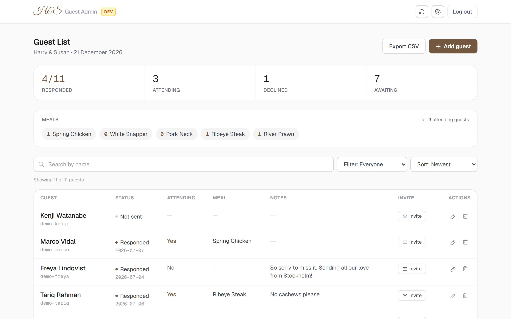
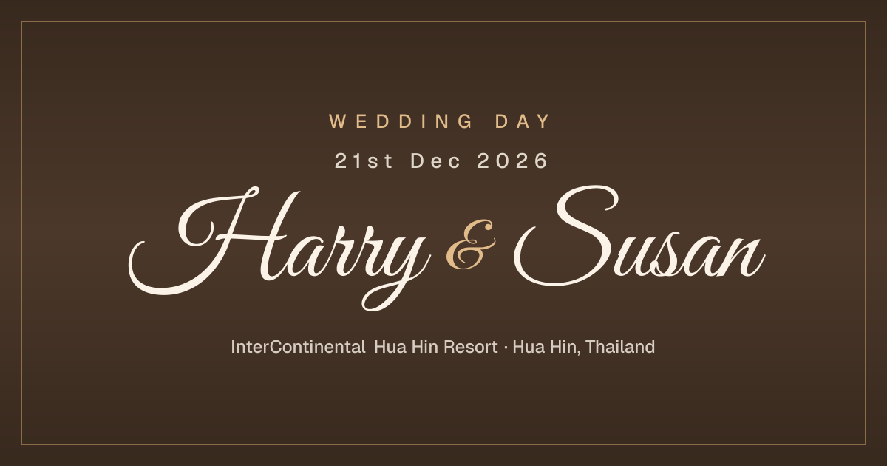

# Wedding RSVP

*An animated envelope invitation with per-guest links, built for a real wedding.*

My friends Harry and Susan are getting married at the InterContinental Hua Hin Resort in December 2026, and this is their invitation and RSVP system. There are about 50 guests, each with a personal link, and nearly all of them open it on a phone.

Claude Code wrote most of the code. I owned everything around it: the product decisions with the couple, the architecture calls (fail-open deadline checks, no edits after submitting, flattened response columns so the CSV export stays trivial), the verification strategy, and design review on a real iPhone. A lot of the work sounded like "the torn edge looks wrong, try again".

**Stack:** Next.js 16 (App Router) · Tailwind v4 · Framer Motion · Prisma 7 · Neon Postgres · Playwright · Vercel

**Try it live:** [open the demo invitation](https://rsvp-wedding-git-dev-pyae-sones-projects-aa9a4476.vercel.app/rsvp/demo-invite) and tap the wax seal. It runs on the test environment with seeded data, so submitting an RSVP is fine.

<p align="center">
  
  
  
</p>

## What guests get

Every guest receives a personal tokenized link; there is no account to create and nothing to install. Tokens are the guest's name slug plus eight random hex characters ([guests.ts](src/lib/guests.ts)), so they read well when pasted into a chat without being guessable, and guest pages are noindexed.

The link opens on a sealed envelope addressed to the guest. Tapping the wax seal starts a choreographed sequence: the seal melts away, the flap peels open, the invitation rises out of the pocket, and the envelope slides off screen. The whole open takes about 3.5 seconds. We tuned every beat of it, then slowed it down on purpose because fast felt cheap.

The invitation itself is one long scroll: a full-bleed photo hero, venue and schedule details, photo blocks with torn-paper edges, a dress code section with the bride's nine approved colour tones rendered as wax droplets, and the RSVP call to action.

The RSVP form asks one question first: can you make it? A yes opens a swipeable carousel of the five plated mains (with a note that the dish photos are AI generated) and a dietary field. A no offers an optional message to the couple. Submitting lands on a confirmation page with a keepsake photo, and any later visit to the RSVP page shows that confirmation instead of the form. There are no edits after submitting; with 50 guests, corrections go through the couple directly.

After the deadline passes (end of the deadline day, Bangkok time) the form closes by itself. Guests who never answered get a warm notice instead of a dead form. The invitation's RSVP button goes quiet, and the submit action refuses late posts server side. The date lives in the admin settings, so the couple can extend it without a deploy.

<p align="center">
  
  
  
</p>

## What the couple gets

A password-gated admin dashboard: response stats, per-dish meal tallies for the kitchen, search, filters, sorting, guest CRUD, and CSV export. An invite-message modal renders a per-guest message from an editable template (name, personal link, date, venue, deadline) and copying it marks the guest as sent. Settings hold the message template and the RSVP deadline behind a date picker.

The preview environment's dashboard (the "playground": dev branch, test database) wears an amber Dev badge so nobody edits the wrong guest list. Production wears nothing.

<p align="center">
  
</p>

Links shared in chat apps get a generated preview card. It renders through next/og's Satori engine at build time, with the fonts subsetted to static weights because Satori cannot consume variable fonts:

<p align="center">
  
</p>

## Engineering notes

**Mobile is the product.** Guests open these links on phones, mostly iPhones, and desktop Chrome kept rendering things that real iOS broke. [verify-mobile.mjs](scripts/verify-mobile.mjs) drives the full journey (envelope, invite, form, submit, confirmation) on emulated iPhone WebKit and Pixel Chromium, 28 assertions per run, and it runs after every guest-facing change. The harness is scenario scripts rather than a test framework: it re-arms the test guest's database row before each engine, listens for page errors and failed network requests the whole way through, and checks for horizontal overflow every 250 pixels of scroll. It exists because of bugs like these:

- Safari ignores CSS `mask-image` in enough cases that the wax seal ships as a `border-radius` clip instead.
- Percentage heights chained through an `aspect-ratio` box resolve to 0px in Safari. The venue carousel was invisible on real iPhones until each slide owned its own aspect ratio.
- `100dvh` grows when the iOS URL bar collapses, which re-zoomed the hero photo mid-scroll. Full-viewport photo sections use `svh`.
- Inputs under 16px trigger iOS focus zoom, so form fields stay at `text-base`.
- Progressive PNG decode paints RGB before alpha, so the seal's transparent PNG flashed as a dark square on 4G until I repainted the pixels under the alpha channel to the paper tone.
- Double-sided 3D transforms render inconsistently across engines, so the envelope flaps are single-face elements with per-element perspective.

Every photo reveal is gated on both scroll position and actual image load ([useImageLoaded](src/components/guest/useImageLoaded.ts)), so slow connections never watch an empty box fade in. Photo originals stay gitignored; only resized web derivatives ship, generated with [make-web-copy.mjs](scripts/make-web-copy.mjs).

The deadline lockout is driven entirely by a settings row. [isDeadlinePassed](src/lib/deadline.ts) compares the stored date against today in the venue's timezone and fails open on malformed values, so bad data can never lock guests out. The respond page, the invite button, and the Server Action each check it independently; a form loaded at 23:58 and submitted at 00:05 still gets refused politely. Moving the date in admin settings reopens everything instantly.

Each git branch maps to its own Vercel environment and its own Neon Postgres branch, running the same code. Test data cannot leak into production because production is a different database. The data layer is Prisma 7 over Neon's serverless driver adapter, and expected failures return null instead of throwing, so a database blip degrades to a friendly retry message rather than unmounting a guest's half-filled form.

[saveRsvp](src/lib/actions.ts) validates every payload server side, because a Server Action is reachable by direct POST: the dish must exist on the menu, control characters are stripped (Postgres rejects NUL bytes in text columns), and free-text fields are length-capped. The admin sits behind an HS256-signed JWT in an httpOnly cookie ([admin-session.ts](src/lib/admin-session.ts)), and the admin layout, every admin Server Action, and the CSV export route each re-check the session on the server.

## Tradeoffs

Scenario scripts instead of a unit test suite. The risk surface here is visual and device-specific, not logic-heavy: a wrong meal tally would be obvious in the admin, but a hero photo that re-zooms mid-scroll on a real iPhone is invisible to a unit test and painfully visible to fifty guests.

No RSVP edits after submitting. Fifty guests all know the couple personally; a human channel beats an edit flow plus the abuse cases it invites.

No rate limiting on the admin login. There is one admin, the password is strong, and the login page is linked from nowhere.

At 500 guests I would revisit all three, in that order.

## Local development

```bash
npm install            # postinstall generates the Prisma client
npm run dev            # http://localhost:3000
npm run db:seed        # reset the dev database to the seeded test guests
```

`.env.local` needs `DATABASE_URL` and `DIRECT_URL` (Neon dev branch, pooled and direct), `ADMIN_PASSWORD`, and `SESSION_SECRET`. The full runbook (per-environment variables, schema migrations, the deployed smoke test, and the go-live checklist) lives in [docs/operations.md](docs/operations.md).

## Deployment workflow

Two long-lived git branches map to two Vercel environments, each with its own
Neon database branch:

```
git branch     Vercel environment          Neon branch
──────────     ─────────────────────       ─────────────────────────
main       ──► Production                  production  (real guests)
dev        ──► Preview (stable alias)      dev         (test data)
```

All work happens on `dev`; every push deploys to the stable preview URL, which doubles as the playground for testing and design review. `main` is a promotion gate: when a batch is approved on the preview, merge `dev → main` and Vercel deploys production. Environment separation is scoped env vars in Vercel, same code with different config.

## Verification scripts

Screenshots land in the gitignored `scripts/shots/`.

| Script | What it proves |
|---|---|
| [`verify-mobile.mjs`](scripts/verify-mobile.mjs) | The full guest journey on emulated iPhone (WebKit) and Pixel (Chromium), 28 checks |
| [`verify-deployed.mjs`](scripts/verify-deployed.mjs) | Both live environments: status codes, page content, robots, OG image, authed admin login |
| [`verify-lockout.mjs`](scripts/verify-lockout.mjs) | The deadline lockout end to end; flips the dev deadline and restores it after |
| [`scroll-shots.mjs`](scripts/scroll-shots.mjs) | Full-invite scroll capture, optionally on WebKit |
| [`venue-shots.mjs`](scripts/venue-shots.mjs) / [`confirm-shots.mjs`](scripts/confirm-shots.mjs) | Carousel behaviour; the confirmation page fits one phone screen |
| [`drop-frames.mjs`](scripts/drop-frames.mjs) / [`seal-throttle.mjs`](scripts/seal-throttle.mjs) | Envelope choreography frame by frame; seal behaviour on a throttled network |
| [`set-deadline.ts`](scripts/set-deadline.ts) / [`reset-rsvp.ts`](scripts/reset-rsvp.ts) | Dev-only helpers to move the deadline or re-arm a test guest |
| [`make-web-copy.mjs`](scripts/make-web-copy.mjs) | Resized, compressed web derivative of a photo original (needs a one-off `npm i -D sharp`) |
